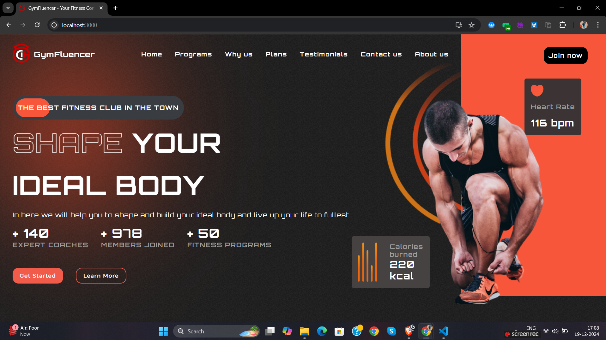

# FitClub ⛹️‍♂️

FitClub : A best Fitness Club Landing Page In Reactjs 💫

This project was bootstrapped with [Create React App](https://github.com/facebook/create-react-app)

## Resources

- [React Docs](https://beta.reactjs.org/)
- [Stackoverflow](https://stackoverflow.com/)

## Authors

- [@Arnab](https://www.github.com/Arnab514)

## Live Preview

[Fitclub ⛹️‍♂️](https://fittclub.netlify.app)



<!-- <https://user-images.githubusercontent.com/65482186/222948714-94b3740e-4721-452c-b26b-7dea22cd54fc.mp4> -->

## Setup

To Setup this project run

```

git clone https://github.com/shuence/FitClub
cd Fitclub
yarn install
yarn start

```

## Features

- Responsive
- Cool UI/UX
- Easy to deploy

## Contributing

Contributions are always welcome!

Please adhere to this project's `code of conduct`.

# Hi, I'm Arnab! 👋

## 🚀 About Me

I'm Shubham A FY B.Tech Student

A Frontend/ Backend/ Full Stack Developer

## 🛠 Skills

Reactjs, Javascript, HTML, CSS, Nextjs, Typescript, Nodejs, Expressjs

## Happy coding 💯

Made with love from Arnab ❤️
